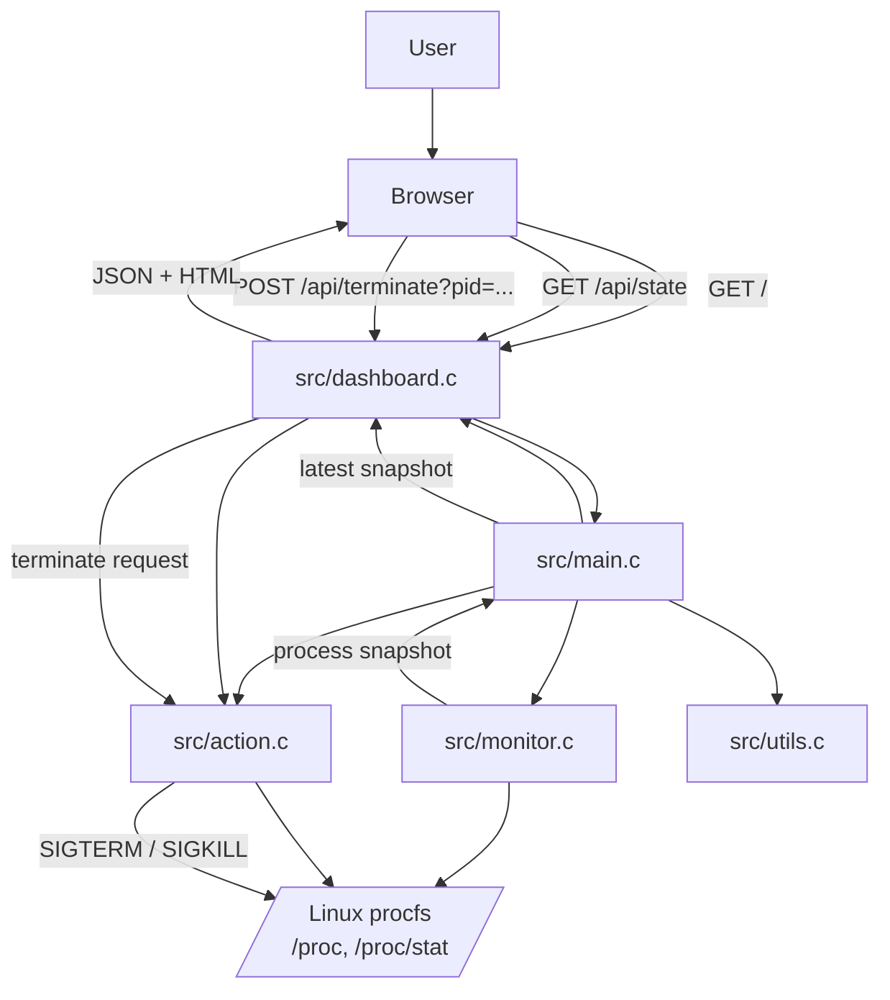
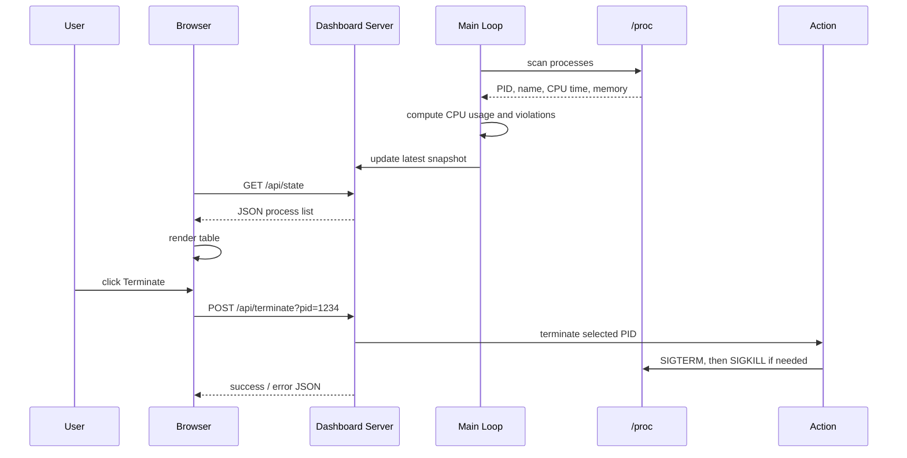

# Process Monitor Diagram Guide

This document is a visual guide to how the system works. It starts with the overall codebase flow, then breaks the runtime behavior into smaller parts.

## 1. System / Codebase Working Diagram



## 2. What Each Block Does

### `src/main.c`

This is the controller of the whole program.

It:

- starts the monitor and dashboard
- runs the scan loop
- checks CPU and memory thresholds
- counts consecutive violations per PID
- triggers auto-kill when needed
- stops the app cleanly on `SIGINT` or `SIGTERM`

### `src/monitor.c`

This module reads process data from `/proc`.

It:

- scans numeric entries in `/proc`
- reads each process name, CPU time, and memory
- computes CPU usage from deltas
- keeps the previous sample table so the next scan can compare values

### `src/dashboard.c`

This module serves the web UI and API.

It:

- opens a local server on `127.0.0.1:7878`
- serves HTML when the browser requests `/`
- serves JSON from `/api/state`
- handles terminate requests from `/api/terminate?pid=...`
- keeps a safe copy of the latest process snapshot

### `src/action.c`

This module performs termination.

It:

- sends `SIGTERM` first
- waits briefly
- sends `SIGKILL` if the process is still alive

### `src/utils.c`

This module contains small helper logic.

Right now it mainly checks whether a `/proc` entry name is numeric.

## 3. Runtime Flow Diagram



## 4. Why Two Update Loops Exist

There are two different timers:

- backend scan loop: every 2 seconds
- frontend refresh loop: every 1 second

This is intentional.

The backend does the expensive work of scanning `/proc`. The frontend only reads the latest snapshot and redraws the table.

## 5. Auto-Kill Decision Diagram

```mermaid
flowchart TD
    Scan[New process scan]
    CheckCPU{CPU >= 80%?}
    CheckMem{Memory >= 2 GB?}
    Violating{Over CPU or memory limit?}
    Count[Increase consecutive count]
    Reset[Reset count to 0]
    Limit{Count >= 3?}
    Protected{Protected process?}
    Kill[Call action_manual_terminate()]
    Skip[Skip auto-kill]

    Scan --> CheckCPU
    CheckCPU -->|yes| Violating
    CheckCPU -->|no| CheckMem
    CheckMem -->|yes| Violating
    CheckMem -->|no| Reset
    Violating --> Count
    Count --> Limit
    Limit -->|no| Skip
    Limit -->|yes| Protected
    Protected -->|yes| Skip
    Protected -->|no| Kill
    Reset --> Skip
```

## 6. Important Design Notes

### Why the GUI is embedded in C

The project does not have a separate frontend framework.

The HTML, CSS, and JavaScript are stored inside `dashboard.c` as a single string. That keeps the project self-contained and easy to run.

### Why the dashboard uses polling

The UI calls `/api/state` every second with `fetch()`.

Polling is simple, reliable, and good enough for a local dashboard.

### Why the dashboard copies process data

The monitor loop and HTTP server run at different times.

A copied snapshot prevents races between scanning and rendering.

### Why the process name is read from `/proc/<pid>/comm`

The name column in the dashboard needs a short, readable process name. `comm` provides that directly.

### Why memory uses a fallback

`/proc/<pid>/status` is the primary source for resident memory. `statm` is a fallback when `status` is not enough.

## 7. Quick Interview Answers

### Q: What is the main job of `main.c`?

A: It coordinates scanning, auto-kill policy, dashboard updates, and shutdown.

### Q: What is the main job of `monitor.c`?

A: It reads `/proc` and produces a process snapshot with CPU and memory information.

### Q: What is the main job of `dashboard.c`?

A: It serves the local web UI and exposes JSON and terminate endpoints.

### Q: What is the main job of `action.c`?

A: It performs the actual process termination sequence.

### Q: Why is CPU usage computed instead of read directly?

A: Linux procfs gives raw CPU time counters, so the program must calculate usage from deltas.

### Q: Why does the UI still work without a separate frontend project?

A: Because the page is embedded and served directly from the C backend.

## 8. Short Summary

The project is a local Linux process monitor that scans procfs, updates a snapshot, serves a browser UI, and can terminate processes manually or automatically based on repeated threshold violations.
